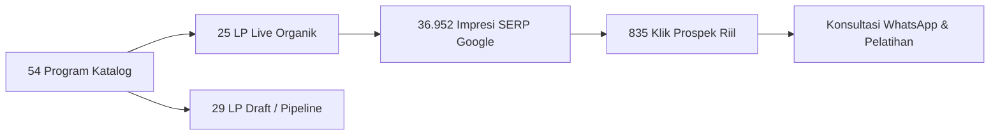
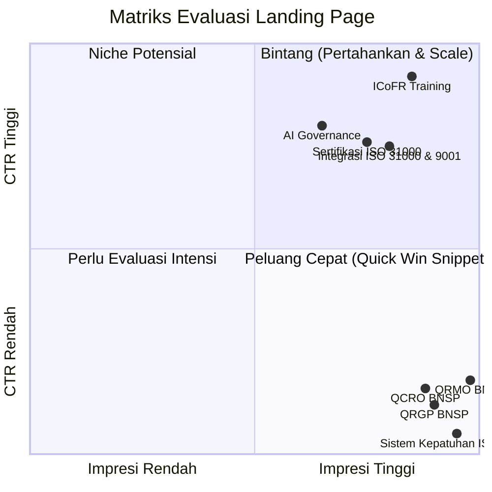

# Dashboard Kinerja Produk & Keyword — GRC Indonesia (Proxsis Academy 2026)

> [!NOTE]
> File dashboard interaktif lengkap telah dibuat dan dapat langsung diakses melalui:
> **[Buka Interactive Dashboard HTML](file:///Users/mukhtarsyafii/.gemini/antigravity/brain/c6c68bbe-3cc9-4b15-b1f6-efcac2aafc9c/dashboard.html)**

---

## 1. Executive Summary & KPI Utama (Periode W1 – W36 Tahun 2026)

Berdasarkan data performa riil dari **Google Search Console (GSC)** yang terekam setiap Jumat sepanjang 36 minggu (Januari s.d. akhir Agustus 2026), berikut ringkasan metrik utama:

| Indikator Kinerja | Realisasi | Keterangan & Catatan Analisis |
| :--- | :---: | :--- |
| **Total Program Terpetakan** | **54 Program** | Katalog lengkap silabus pelatihan & sertifikasi |
| **Landing Page (LP) Aktif** | **25 LP (46%)** | Telah tayang di domain `grc-indonesia.com` |
| **Pipeline & Draft LP** | **29 LP (54%)** | Target peluncuran min. 2 LP baru per minggu |
| **Total Impresi Organik** | **36.952** | Puncak tayangan terjadi pada W6 (1.937 tayangan/mgg) |
| **Total Klik Organik** | **835 Klik** | Kunjungan langsung dari pengguna berintensi tinggi |
| **Rata-rata CTR Organik** | **2,26%** | Standar B2B training (2,0% – 4,0%) |
| **Top Performer Organik** | **ICoFR Training** | 233 Klik • CTR 9,64% • Peringkat #9 |

---

## 2. Top 10 Program Pelatihan Berdasarkan Klik Organik

Program-program ini merupakan **mesin penggerak prospek utama** bagi GRC Indonesia, ditandai dengan peringkat stabil di halaman pertama Google dan rasio klik (CTR) yang sehat.

| No | Program Layanan | Keyword Utama | Search Vol | Impresi | Klik | CTR (%) | Rank SERP |
| :---: | :--- | :--- | :---: | :---: | :---: | :---: | :---: |
| **1** | **ICoFR Intensive Training** | *Training ICoFR* | 150 | 2.418 | **233** | **9,64%** | #9 |
| **2** | **Integrasi ISO 31000 & ISO 9001** | *Integrasi ISO 31000 dan ISO 9001* | 80 | 2.115 | **123** | **5,82%** | #6 |
| **3** | **Sertifikasi Risk Management ISO 31000** | *Sertifikasi ISO 31000* | 500 | 1.679 | **100** | **5,96%** | #10 |
| **4** | **Training AI Governance** *(Rising Star)* | *Training AI governance* | 90 | 975 | **66** | **6,77%** | #17 |
| **5** | **Pelatihan QRMO BNSP** | *Pelatihan QRMO* | 200 | 4.809 | **36** | **0,75%** | #12 |
| **6** | **Pelatihan Compliance ISO 37301** | *Pelatihan ISO 37301* | 150 | 933 | **35** | **3,75%** | #15 |
| **7** | **Pelatihan QRMA BNSP** | *Pelatihan QRMA* | 300 | 2.366 | **32** | **1,35%** | #10 |
| **8** | **Pelatihan & Sertifikasi ISO 31000:2018** | *Pelatihan manajemen risiko ISO 31000* | 450 | 3.332 | **26** | **0,78%** | #10 |
| **9** | **Training Fraud Management** | *Training fraud management* | 150 | 516 | **26** | **5,04%** | #12 |
| **10**| **Training Grafonomi & Uang Palsu** | *Pelatihan grafologi perusahaan* | 200 | 896 | **24** | **2,68%** | #8 |

---

## 3. Matriks Peluang Optimasi Cepat (*Quick Wins: High Impression, Low CTR*)

> [!TIP]
> Halaman-halaman berikut telah berhasil mendapatkan peringkat tinggi di Google (impresi masif), namun **rasio konversi klik ke website masih sangat kecil**. Hanya dengan **merombak Meta Title & Meta Description** agar lebih persuasif, halaman ini dapat mendongkrak puluhan hingga ratusan prospek baru tanpa perlu menunggu kenaikan peringkat.

### Rincian Peluang Cepat:
1. **Training Sistem Manajemen Kepatuhan (ISO 37301):**
   * *Impresi:* **4.266** | *Klik:* **0 (CTR 0,00%)** | *Rank:* **#3 – #5**
   * *Aksi:* Segera perbarui Meta Title di CMS. Tambahkan elemen penarik seperti: *"Training ISO 37301 Sistem Manajemen Kepatuhan 2026 — Jadwal & Sertifikasi GRC Indonesia"*.
2. **Sertifikasi Eksekutif BNSP (QRMO, QRGP, QCRO):**
   * **QRMO:** 4.809 impresi tapi baru 36 klik (CTR 0,75%).
   * **QRGP:** 3.436 impresi tapi baru 10 klik (CTR 0,29%).
   * **QCRO:** 3.275 impresi tapi baru 19 klik (CTR 0,58%).
   * *Aksi:* Pasang **FAQ Rich Schema**, cantumkan legalitas pengakuan BNSP / LSP di deskripsi pencarian Google, dan sebutkan tanggal jadwal kelas terdekat.

---

## 4. Temuan Kritis Audit Kesesuaian Konten (*Content Mismatch*)

> [!WARNING]
> Berdasarkan tab `Content Mismatch Audit`, ditemukan masalah inkonsistensi yang langsung merugikan performa SEO dan pengalaman pengguna:

1. **Mismatch Berat (High Severity):**
   * **Halaman:** `Training High Impact Report Audit Writing`
   * **URL:** `https://grc-indonesia.com/training-high-impact-report-audit-writing/`
   * **Masalah:** Judul dan URL adalah Audit Writing, namun **isi badan artikel dan H2 justru materi Training ISO 45001 (SMK3)**. Pengunjung yang mencari materi audit penulisan laporan langsung keluar (bounce).
   * **Rekomendasi:** Segera ganti isi halaman dengan silabus audit writing yang sebenarnya.
2. **Redirection 301 & URL Baru:**
   * Halaman `Pelatihan Integrasi ES-GRC` sempat 404 sebelum dialihkan ke slug baru `/pelatihan-integrasi-es-grc-bersertifikat/`. Pastikan aturan 301 redirect di server web berjalan permanen.

---

## 5. Komparasi Lintas Brand di Lingkungan Proxsis Academy

Data pembanding mingguan antar unit bisnis Proxsis (Minggu ke-33):

| Unit Bisnis / Brand | Fokus Pelatihan | LP Aktif | Impresi/Mgg | Klik/Mgg | CTR (%) |
| :--- | :--- | :---: | :---: | :---: | :---: |
| **ISO Center** | ISO 9001, 14001, 45001, 27001 | 24 | 3.324 | 96 | 2,89% |
| **Proxsis Academy** | Vokasi, HR & Manajemen Umum | 21 | 1.202 | 13 | 1,08% |
| **GRC Indonesia** | Governance, Risk, Compliance & Fraud | 25 | 713 | 25 | **3,51%** |
| **IPQI** | Lean Manufacturing, Six Sigma, 5S/5R | 34 | 518 | 8 | 1,54% |
| **FS Institute** | Food Safety & Finance Banking | 8 | 21 | 0 | 0,00% |

> **Highlight:** Meskipun impresi mingguan GRC Indonesia berada di peringkat ketiga, **konversi CTR-nya (3,51%) merupakan yang tertinggi** di antara unit bisnis Proxsis, membuktikan bahwa pasar B2B GRC memiliki audiens dengan daya beli dan urgensi kepatuhan yang sangat kuat.

---

## 6. Fitur Interaktif pada Dashboard HTML

Dashboard yang telah dibangun di **[dashboard.html](file:///Users/mukhtarsyafii/.gemini/antigravity/brain/c6c68bbe-3cc9-4b15-b1f6-efcac2aafc9c/dashboard.html)** memiliki fitur-fitur operasional berikut:
* 🔍 **Pencarian Real-Time:** Mencari berdasarkan nama produk, keyword utama, ataupun target keyword transaksional.
* 🏷️ **Filter Kategori & Status:** Memfilter program (Sertifikasi BNSP, ISO, Audit/Fraud, BUMN/Tata Kelola, AI) dan status (Aktif vs Draft).
* ↕️ **Multi-Sorting:** Mengurutkan instan berdasarkan Klik Terbanyak, Impresi Tertinggi, CTR Tertinggi, atau Ranking Google.
* 📈 **Interactive SVG Trend Chart:** Memvisualisasikan kurva lonjakan impresi dan klik dari W1 hingga W36.
* 🗂️ **Detail Drawer / Modal:** Menampilkan arsitektur kata kunci 3 tingkat (Utama, Target, Informasional), estimasi volume pencarian bulanan, serta saran optimasi per halaman.
